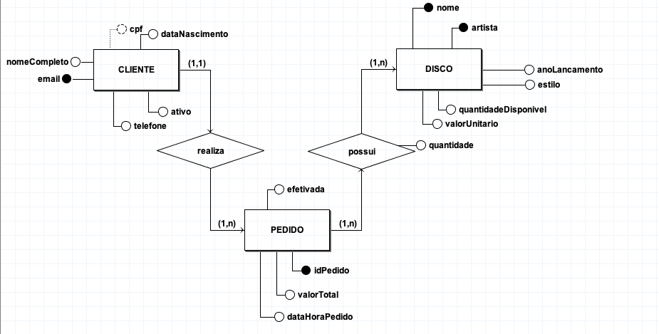
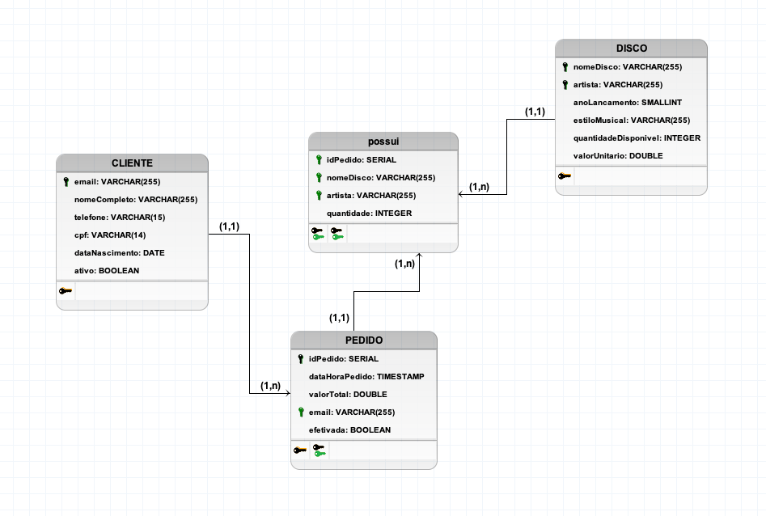

# API Flask

## Tecnologias Utilizadas

* Docker
* Docker Compose
* Python 3.9
* PostgreSQL
* AWS
## Bibliotecas Utilizadas

* psycopg2
* flask
* pytz

## Modelagem de Dados

### Diagrama Entidade Relacionamento



### Diagrama Lógico



### Funcionalidades

* Listar todos os clientes
* Listar um cliente
* Criar cliente
* Inativar conta do cliente

* Listar todos os discos
* Listar discos de um artista, nome, estilo musical ou ano de lançamento
* Criar disco

* Criar compra
* Listar todas as compras
* Listar compra a partir de um id, cliente, ou período de tempo

(Está anexado no repositório a collection do Insomnia com as requisições para os endpoints da API, com os devidos environments local e AWS)
Disponível na pasta assets, na raiz do projeto: [Collection](./assets/Insomnia_2022-03-27.json)

## Cenários

### Cenário de compra

1 - Criar cliente
2 - Criar disco
3 - Criar compra (Só será possível se o cliente existir, o disco existir e tiver a quantidade desejada disponível de disco no estoque)

Caso não tenha a quantidade disponível, a compra é criada no banco porém com Efetivada = False.

## Deploy

O deploy foi realizado utilizando uma máquina virtual da AWS com IP Fixo

Disponível em: ```http://23.21.16.151:8080```
## Pontos de melhoria

* Utilizar o AWS Lambda e o AWS Relational Database Service, com o objetivo de gerenciar melhor os recursos de computação exigidos pela api, melhorando o custo-benefício e a escalabilidade.

* Utilização do Docker Swarm para escalar o deploy na máquina virtual.

* Criar cancelamento de compra.

* Com objetivo de evitar o problema de acesso simultâneo ao banco de dados, com o dado crítico que seria a quantidade de discos em estoque, foi pensado em criar um job para criação e manutenção de uma fila de requisições de compra, porém gostaria de fazer um teste de estresse na API e melhor analisar esta situação.

## Justificativas

* As tecnologias foram escolhidas por afinidade, e a AWS por interesse de aprendizado.

* O deploy foi realizado na AWS em uma máquina virtual como plano B, com um IP fixo, para que o cliente possa acessar a API. O Plano A era a utilização do AWS Relational Database Service, em que deu certo, e o AWS Lambda devido o gerenciamento de recursos, custo-benefício e escalabilidade, porém após horas gastas ainda não estava funcionando perfeitamente, estava ocorrendo um erro na biblioteca psycopg2 lá dentro do Lambda. Para isso, precisaria de mais tempo para um melhor aprendizado do AWS Lambda para realização de uma solução melhor estruturada, segura e eficiente. A tentativa de utilização do AWS Lambda, demandou bastante utilização da biblioteca Zappa para a criação do deploy, aprendizado do IAM e Amazon API Gateway.

* Não foi utilizada ORM, por ter maior afinidade com SQL, o foco foi fazer funcionar a solução como um todo.